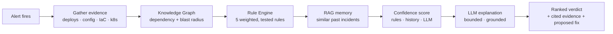

# Culprit — a case study in building an AI system you can actually trust

> **What:** an AI SRE copilot that, when a production alert fires, answers
> "which recent change caused this?" by correlating deploys, config, IaC,
> and Kubernetes events against the alert — then explains its verdict with
> cited evidence.
>
> **The hard part:** not calling an LLM. Making an AI system whose
> conclusions are *deterministic, auditable, and safe to act on* — where the
> language model explains, and provably cannot invent.
>
> **Status (stated the way the whole project is):** the core loop is built,
> tested, and CI-verified end to end; cloud deploy and live API calls are
> written and gated on credentials, not code. No real-customer validation
> yet — that's the deliberately-next step, not a finished claim.

---

## The problem

During an incident, the single most expensive question is "what changed?"
— and it's the one no tool answers well. Deploy history lives in GitHub,
config in ArgoCD, infra in Terraform, symptoms in Prometheus, and pod state
in `kubectl`. Under time pressure, an on-call engineer cross-references five
disconnected systems by hand while the outage runs. That cross-referencing
phase — not the fix — is consistently the longest segment of a public
incident timeline, and it's where a 5-minute blip becomes a 45-minute
outage.

Incumbents show deploy *markers* on a dashboard (visual only, no reasoning),
or correlate alerts to each other but never to the code change that caused
them. None join git + Helm + Terraform + k8s + metrics into one causal
answer. That gap is the product.

## What I built: one core loop, done deliberately

**Detect → Correlate → Reason → Recommend → Human-approve → Learn.** No
sprawling feature set — one loop, executed to depth:

Steps B–F are pure, deterministic, testable code. The LLM enters only at G,
and only to explain what the deterministic layers already decided.

## The three decisions that make it senior work

Anyone can wire an alert to `messages.create()` and print the reply. The
engineering is in what that gets wrong, and refusing to ship it.

### 1. The LLM is not the source of truth

The failure mode of an "AI DevOps" tool isn't too little AI — it's an LLM
where a five-line SQL query would do, producing a system that's slow,
expensive, unauditable, and confidently wrong. So the causal work is
deterministic:

- A **Knowledge Graph** (Postgres edges, recursive-CTE traversal) models
  service dependencies, sibling coupling through shared resources, and
  monitoring topology.
- A **Rule Engine** of five named, individually unit-tested rules
  (time proximity, ownership distance, diff-keyword match, historical
  pattern, blast radius) scores each candidate change with cited evidence.
- A **confidence score** decomposes into `rules · history · LLM`, and the
  LLM's contribution is **hard-capped at ±15%**. It can nuance a number; it
  cannot manufacture certainty.
- An **evidence-grounding guardrail**: every fact the LLM cites is validated
  against the real evidence objects before it's shown. An invented citation
  is stripped and flagged, and the model's confidence adjustment is zeroed.

The result: the system produces a correct, evidence-backed answer *even if
the LLM call fails, times out, or is switched off entirely.* That's the
difference between a demo and something an SRE will trust with a rollback.

### 2. Test infrastructure before intelligence — and the bugs it caught

The first thing built wasn't the AI. It was an **Incident Simulation
Harness**: 18 ground-truthed synthetic incidents, each a distinct failure
axis — cross-service config breaks, deadlocks through a shared database,
IAM revokes that bite on a delayed credential refresh, feature-flag ramps
with no commit at all, monitoring changes that blind healthy services.

This wasn't box-ticking. The harness *found real bugs in the correlation
engine before any of them could reach a user*:

- Three separate **graph-traversal direction bugs** — the engine was
  reasoning about causality backwards (scoring a deploy's dependencies
  instead of its dependents). Every scenario with a same-service culprit had
  masked them; the first cross-service scenario exposed each one. All three
  are now permanently guarded by the scenario that caught them.
- A **false-precedent bug** in the RAG memory: alert-title boilerplate was
  manufacturing similarity between unrelated incidents. The fix was
  structural (a two-sided symptom × cause score), and a leave-one-out
  regression pins it.

An LLM layered on top of any of those would have *confidently explained
wrong answers* — which is exactly why the deterministic layer had to be
proven first.

### 3. Freeze the spec, amend by ADR

Before implementation, the design was frozen in a `SPEC_VERSION.md` — the
rule set, the confidence formula, the ±15% bound, the evaluation metrics.
Not decoration: when the monitoring-topology scenario needed a new graph
edge type, that change went through a written **Architecture Decision
Record** and a dated amendment-log entry, not a silent edit. The reasoning
(why monitoring is a *separate causal channel*, never runtime coupling) is
recorded and defensible. Two ADRs govern the two changes that touched frozen
decisions.

## How it's verified

- **The test suite is the evaluation.** ~62 tests; every one of the 18
  scenarios is a golden-set case, and CI gates **precision@1 = 100%** (the
  top candidate must be the injected cause) plus the full expectation set:
  confidence floors, rule hits, evidence citations, strict decoy ordering,
  timeline chronology, and the LLM guardrail contract. A rule or weight
  change that flips any ranking fails before merge.
- **The evaluation is honest about itself.** `culprit eval` reports per-rule
  precision and — when a single rule matches the whole pipeline on the
  simulated set — prints an *authored-data bias* warning: the hand-built
  scenarios discriminate too cleanly, which is why real-incident precision
  is an explicit, still-unmet exit criterion. The tool flags its own
  weakness.
- **CI runs it all on every push**: the pipeline suite against a real
  Postgres/pgvector container, the container image built and **deployed to a
  live `kind` cluster** with an HTTP check through the Service, the Next.js
  build, and Terraform `fmt`/`validate`. When a run failed once on an
  ambiguous Postgres hiccup, the fix was to make CI post its own failure log
  as a commit comment — diagnosability as a permanent affordance.

## Proven vs. designed (the honest line)

The deterministic pipeline, both memory backends (lexical and pgvector,
tested against real Postgres), the LLM explanation layer, the `culprit` CLI,
and the web UI all run and are tested. The production LLM client and the
semantic embedder are contract-pinned by deterministic stand-ins but not
exercised against live APIs here. The EKS/Terraform/ArgoCD deploy is
`kind`-verified and Terraform-validated but not applied to a real cluster.
**No design-partner usage or real-incident precision numbers exist yet** —
those are the next gate, and the repo says so everywhere rather than
implying completeness.

## Stack

Python (correlation engine + reasoning service) · Go service scaffold ·
Next.js / TypeScript / Tailwind (web UI) · PostgreSQL + pgvector · Helm +
Kubernetes (kind-verified) · Terraform + EKS (OIDC keyless CI, validated) ·
GitHub Actions CI with golden-set evaluation. 36 commits, CI green
throughout, every non-trivial change verified against the harness before merge.

## What this demonstrates

| Area | Shown by |
|---|---|
| Distributed-systems debugging | The whole premise, plus the graph-direction bugs and how they were caught |
| AI systems that are safe in production | The ±15% bound, evidence grounding, propose-not-execute, confidence thresholds |
| Kubernetes / GitOps internals | Evidence sources, the dependency+monitoring graph, Helm/ArgoCD, kind CI |
| Test & evaluation design | Harness-before-AI, golden-set precision gates, per-rule metrics, the self-flagged bias |
| Engineering judgment | Frozen spec + ADRs; one core loop done well over fifteen shallow features |
| Product thinking | The problem-first framing, and validation named as the real next step, not skipped |

The interview version of every row above is a specific decision with a
specific reason — not a stack list. That's the point of the whole project.

---

*Built with a strict discipline: depth over breadth, deterministic evidence
before AI reasoning, and every claim backed by a reproducible test. Full
design docs in [`docs/`](docs/), the frozen spec in
[`SPEC_VERSION.md`](SPEC_VERSION.md), the go-live runbook in
[`SETUP.md`](SETUP.md).*
