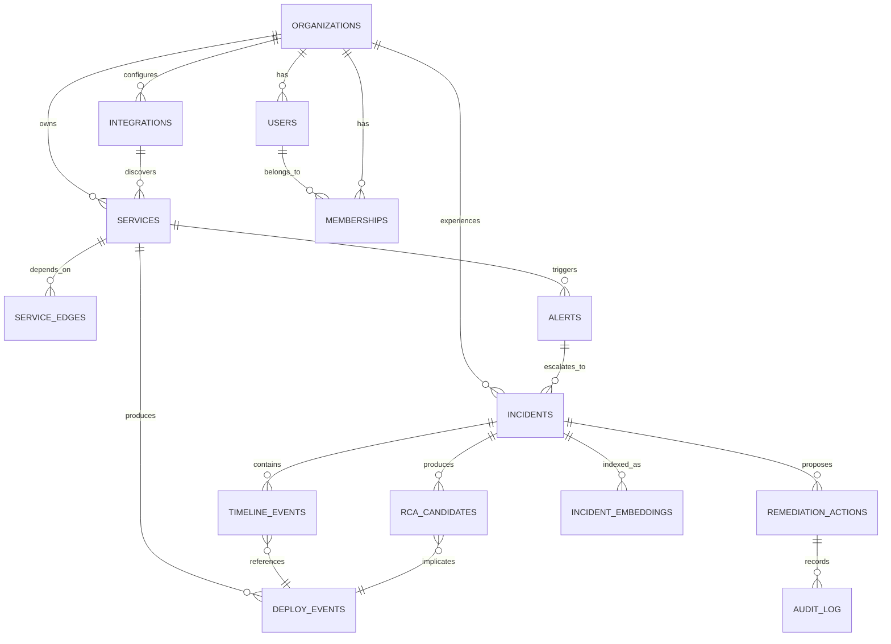

# Part 6: Database Design

PostgreSQL. One database, `org_id` scoping + row-level security for
multi-tenancy (see [03-architecture.md](03-architecture.md)). pgvector
extension enabled for the incident-memory RAG (MVP; migrate to a dedicated
vector DB only past ~1M embedded chunks or if query latency demands it).

## ER diagram



## Core tables

```sql
-- Tenancy & identity
CREATE TABLE organizations (
    id            uuid PRIMARY KEY DEFAULT gen_random_uuid(),
    name          text NOT NULL,
    plan          text NOT NULL DEFAULT 'trial',   -- trial|team|enterprise
    created_at    timestamptz NOT NULL DEFAULT now()
);

CREATE TABLE users (
    id            uuid PRIMARY KEY DEFAULT gen_random_uuid(),
    email         citext UNIQUE NOT NULL,
    name          text,
    created_at    timestamptz NOT NULL DEFAULT now()
);

CREATE TABLE memberships (
    org_id        uuid NOT NULL REFERENCES organizations(id) ON DELETE CASCADE,
    user_id       uuid NOT NULL REFERENCES users(id) ON DELETE CASCADE,
    role          text NOT NULL DEFAULT 'member',  -- owner|admin|member|viewer
    PRIMARY KEY (org_id, user_id)
);

-- Customer environment
CREATE TABLE integrations (
    id            uuid PRIMARY KEY DEFAULT gen_random_uuid(),
    org_id        uuid NOT NULL REFERENCES organizations(id) ON DELETE CASCADE,
    kind          text NOT NULL,       -- github|kubernetes|terraform_cloud|prometheus|pagerduty
    config        jsonb NOT NULL,      -- non-secret config only
    secret_ref    text,                -- pointer into Secrets Manager, never the secret itself
    status        text NOT NULL DEFAULT 'pending',
    created_at    timestamptz NOT NULL DEFAULT now()
);

CREATE TABLE services (
    id            uuid PRIMARY KEY DEFAULT gen_random_uuid(),
    org_id        uuid NOT NULL REFERENCES organizations(id) ON DELETE CASCADE,
    name          text NOT NULL,
    namespace     text,                -- k8s namespace, if applicable
    repo_url      text,
    owner_team    text,
    created_at    timestamptz NOT NULL DEFAULT now(),
    UNIQUE (org_id, name)
);

-- Knowledge Graph: services, dependencies, ownership.
-- Modeled as edges in Postgres, not a dedicated graph database — at the
-- node/edge counts a single org's service topology produces (hundreds to
-- low thousands), a recursive CTE is fast and it's one less system to run.
CREATE TABLE service_edges (
    id            uuid PRIMARY KEY DEFAULT gen_random_uuid(),
    org_id        uuid NOT NULL REFERENCES organizations(id) ON DELETE CASCADE,
    from_service_id uuid NOT NULL REFERENCES services(id) ON DELETE CASCADE,
    to_service_id   uuid NOT NULL REFERENCES services(id) ON DELETE CASCADE,
    edge_type     text NOT NULL,       -- depends_on|owned_by|deployed_via|shares_namespace
    source        text NOT NULL,       -- k8s_ownerref|service_mesh|helm_chart|manual
    metadata      jsonb,
    discovered_at timestamptz NOT NULL DEFAULT now(),
    UNIQUE (org_id, from_service_id, to_service_id, edge_type)
);

-- Rule Engine: rules themselves are versioned, unit-tested code
-- (correlation-engine/rules/*.py), not rows in a table — a rules table
-- holding executable logic is a bug generator, not a rule engine. What
-- *is* configurable per-org without a deploy is each rule's weight and
-- enable/disable state, which genuinely needs to be tunable at runtime
-- (an org with no service mesh should down-weight a mesh-dependent rule).
CREATE TABLE correlation_rule_configs (
    org_id        uuid NOT NULL REFERENCES organizations(id) ON DELETE CASCADE,
    rule_name     text NOT NULL,        -- e.g. 'time_proximity', 'ownership_distance',
                                         -- 'diff_keyword_match', 'historical_pattern_match'
    enabled       boolean NOT NULL DEFAULT true,
    weight        numeric(4,3) NOT NULL DEFAULT 1.000,
    updated_at    timestamptz NOT NULL DEFAULT now(),
    PRIMARY KEY (org_id, rule_name)
);

-- Evidence (append-only, high volume)
CREATE TABLE deploy_events (
    id            uuid PRIMARY KEY DEFAULT gen_random_uuid(),
    org_id        uuid NOT NULL REFERENCES organizations(id) ON DELETE CASCADE,
    service_id    uuid NOT NULL REFERENCES services(id) ON DELETE CASCADE,
    source        text NOT NULL,       -- github|argocd|terraform|helm
    git_sha       text,
    diff_summary  jsonb,               -- files changed, helm values diff, tf plan summary
    deployed_by   text,
    occurred_at   timestamptz NOT NULL,
    created_at    timestamptz NOT NULL DEFAULT now()
);

CREATE TABLE alerts (
    id            uuid PRIMARY KEY DEFAULT gen_random_uuid(),
    org_id        uuid NOT NULL REFERENCES organizations(id) ON DELETE CASCADE,
    service_id    uuid REFERENCES services(id),
    source        text NOT NULL,       -- prometheus|pagerduty|datadog
    title         text NOT NULL,
    severity      text NOT NULL,
    fired_at      timestamptz NOT NULL,
    resolved_at   timestamptz,
    raw_payload   jsonb
);

-- The core loop's output
CREATE TABLE incidents (
    id            uuid PRIMARY KEY DEFAULT gen_random_uuid(),
    org_id        uuid NOT NULL REFERENCES organizations(id) ON DELETE CASCADE,
    title         text NOT NULL,
    status        text NOT NULL DEFAULT 'investigating', -- investigating|identified|resolved
    severity      text NOT NULL,
    primary_alert_id uuid REFERENCES alerts(id),
    opened_at     timestamptz NOT NULL DEFAULT now(),
    resolved_at   timestamptz
);

CREATE TABLE timeline_events (
    id            uuid PRIMARY KEY DEFAULT gen_random_uuid(),
    incident_id   uuid NOT NULL REFERENCES incidents(id) ON DELETE CASCADE,
    event_type    text NOT NULL,       -- alert_fired|deploy|k8s_event|remediation|comment
    ref_table     text,                -- 'deploy_events' | 'alerts' | etc, for polymorphic ref
    ref_id        uuid,
    occurred_at   timestamptz NOT NULL,
    payload       jsonb
);

CREATE TABLE rca_candidates (
    id              uuid PRIMARY KEY DEFAULT gen_random_uuid(),
    incident_id     uuid NOT NULL REFERENCES incidents(id) ON DELETE CASCADE,
    deploy_event_id uuid REFERENCES deploy_events(id),
    confidence      numeric(4,3) NOT NULL,   -- final composite, see 07-ai-architecture.md
    confidence_breakdown jsonb NOT NULL,     -- {"rule_score": 0.61, "rag_score": 0.78,
                                              --  "llm_calibration": 0.92, "rules_fired": [...]}
                                              -- — the "why 92%" the UI renders; never just
                                              -- a bare LLM-asserted number.
    reasoning       text NOT NULL,           -- human-readable explanation, shown in UI
    evidence        jsonb NOT NULL,          -- structured evidence, each item traceable to
                                              -- a specific rule, graph query, or RAG hit —
                                              -- validated at write time (see 07) so the LLM
                                              -- cannot cite evidence that doesn't exist.
    rank            int NOT NULL,
    created_at      timestamptz NOT NULL DEFAULT now()
);

CREATE TABLE remediation_actions (
    id              uuid PRIMARY KEY DEFAULT gen_random_uuid(),
    incident_id     uuid NOT NULL REFERENCES incidents(id) ON DELETE CASCADE,
    action_type     text NOT NULL,      -- helm_rollback|pr_revert|scale_deployment
    target          jsonb NOT NULL,     -- what it acts on
    proposed_diff   text,               -- shown to human before approval
    status          text NOT NULL DEFAULT 'proposed', -- proposed|approved|executed|rejected|failed
    approved_by     uuid REFERENCES users(id),
    executed_at     timestamptz,
    created_at      timestamptz NOT NULL DEFAULT now()
);

CREATE TABLE audit_log (
    id              uuid PRIMARY KEY DEFAULT gen_random_uuid(),
    org_id          uuid NOT NULL REFERENCES organizations(id),
    actor           text NOT NULL,      -- user id or 'system'
    action          text NOT NULL,
    target_table    text,
    target_id       uuid,
    metadata        jsonb,
    created_at      timestamptz NOT NULL DEFAULT now()
);

-- RAG memory
CREATE TABLE incident_embeddings (
    id              uuid PRIMARY KEY DEFAULT gen_random_uuid(),
    incident_id     uuid NOT NULL REFERENCES incidents(id) ON DELETE CASCADE,
    org_id          uuid NOT NULL REFERENCES organizations(id) ON DELETE CASCADE,
    chunk_text      text NOT NULL,
    embedding       vector(1536) NOT NULL,
    created_at      timestamptz NOT NULL DEFAULT now()
);
```

## Indexes

```sql
-- Hot path: "what deploys happened in this service during this time window"
CREATE INDEX idx_deploy_events_service_time ON deploy_events (service_id, occurred_at DESC);
CREATE INDEX idx_alerts_org_fired ON alerts (org_id, fired_at DESC);
CREATE INDEX idx_timeline_incident_time ON timeline_events (incident_id, occurred_at);
CREATE INDEX idx_incidents_org_status ON incidents (org_id, status);

-- RLS-friendly: org_id first column on every tenant-scoped index above
-- so Postgres can use the index for both the RLS policy filter and the query filter.

-- Vector search (pgvector, IVFFlat — fine up to ~1M rows per org's shard)
CREATE INDEX idx_incident_embeddings_vector ON incident_embeddings
    USING ivfflat (embedding vector_cosine_ops) WITH (lists = 100);

-- JSONB evidence search (used by "why did the AI think this" UI drill-down)
CREATE INDEX idx_rca_candidates_evidence_gin ON rca_candidates USING gin (evidence);

-- Knowledge Graph traversal (both directions — "what does this depend on"
-- and "what depends on this" are both real queries, e.g. blast radius vs.
-- root-cause candidate scoring)
CREATE INDEX idx_service_edges_from ON service_edges (org_id, from_service_id);
CREATE INDEX idx_service_edges_to   ON service_edges (org_id, to_service_id);
```

## Knowledge Graph traversal example

Blast radius query ("what services are downstream of the service that just
deployed, out to 3 hops") — this is the query the Rule Engine's
`ownership_distance` rule and the UI's blast-radius view both run:

```sql
WITH RECURSIVE downstream AS (
    SELECT to_service_id AS service_id, 1 AS depth
    FROM service_edges
    WHERE org_id = $1 AND from_service_id = $2 AND edge_type = 'depends_on'
    UNION ALL
    SELECT se.to_service_id, d.depth + 1
    FROM service_edges se
    JOIN downstream d ON se.from_service_id = d.service_id
    WHERE se.org_id = $1 AND d.depth < 3
)
SELECT DISTINCT service_id, MIN(depth) AS hops FROM downstream GROUP BY service_id ORDER BY hops;
```

`# ponytail: Postgres recursive CTE, not Neo4j/Memgraph. Upgrade to a
dedicated graph database only if traversal depth/fan-out grows past what a
CTE handles interactively (rough ceiling: tens of thousands of edges per
org, multi-hop queries under ~200ms) — not before, since that's a new piece
of infra to operate for a problem SQL already solves at this scale.`

## Row-level security (multi-tenancy enforcement)

```sql
ALTER TABLE incidents ENABLE ROW LEVEL SECURITY;
CREATE POLICY org_isolation ON incidents
    USING (org_id = current_setting('app.current_org_id')::uuid);
-- Repeated for every org_id-scoped table. The API layer sets
-- app.current_org_id per-request from the authenticated session — a bug in
-- application code can no longer leak cross-tenant data, the database enforces it.
```

## Optimization notes

- `deploy_events`, `alerts`, `timeline_events`, `audit_log` are append-only
  and grow unbounded — partition by `org_id` hash + monthly range on
  `occurred_at`/`created_at` once any single table passes ~50M rows. Not
  needed at MVP scale; noting it now so it's not a surprise later.
- `rca_candidates.evidence` and `deploy_events.diff_summary` are JSONB
  because their shape genuinely varies by source (a Terraform plan summary
  and a Helm values diff don't share a schema) — this is the correct use of
  JSONB, not a shortcut around real modeling.
- Incident embeddings are per-org, so an IVFFlat index per org (via
  partitioning) beats one global index once org counts grow — defer until
  there's more than one org with real incident volume.

Continue to [06-api-design.md](06-api-design.md).
